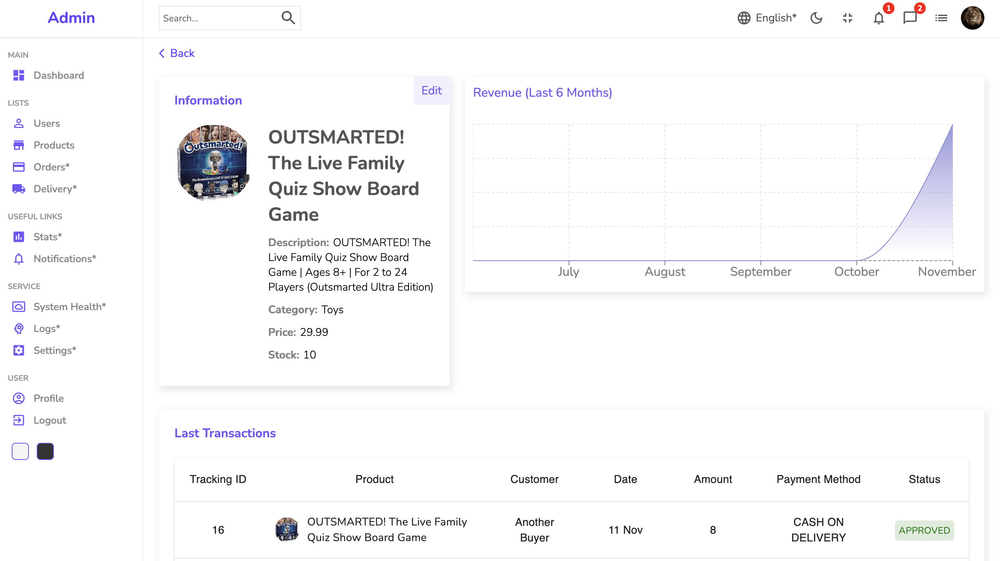

# Admin Panel

This app is deployed at [https://ning-admin-panel-project.netlify.app](https://ning-admin-panel-project.netlify.app)

A dynamic full-stack app for online sellers to manage their products and monitor sales. An admin role is added to the system to manage users and can also handle products on their behalf.

## Table of contents

- [Admin Panel](#admin-panel)
  - [Table of contents](#table-of-contents)
  - [General info](#general-info)
  - [Login and password](#login-and-password)
    - [Admin](#admin)
    - [User](#user)
  - [Technologies](#technologies)
  - [Run this project locally](#run-this-project-locally)
    - [Client setting up](#client-setting-up)
    - [Server setting up](#server-setting-up)

## General info

This project is built for practicing purposes, including implementing React Context to handle user data and page theme colors, conditionally rendering pages using the same templates, working with public and private RESTful API, practicing css flex-box display, and adopting Material UI.

## Login and password

### Admin

Email: admin@admin.com
Password: 123

### User

Email: user1@user.com
Password: 123

## Technologies

Project is created with:

HTML, SCSS, JavaScript, React, Material UI, Axios, NodeJS, Express.js, Prisma, PostgreSQL, JSON Web Token, bcrypt

Core features include using React Context to handle user and theme data and Recharts API to display data dynamically.

The server is hosted on AWS and the client on Netlify.

## Run this project locally

Clone this repository to your machine.

### Client setting up

1. Open a terminal and cd into `client`
2. Rename the `.env.example` file to `.env`
3. Run `npm ci` to install the project dependencies.
4. Run the client with `npm start`.
5. Point your browser to localhost:3000

### Server setting up

1. Open another terminal and cd into `server`
2. Create a new database instance in ElephantSQL.
3. Rename the `.env.example` file to `.env`
4. Edit the `DATABASE_URL` variable in `.env`, swapping `YOUR_DATABASE_URL` for the URL of the database you just created. Leave `?schema=prisma` at the end.
5. Edit the `SHADOW_DATABASE_URL` variable in `.env`, swapping `YOUR_SHADOW_DATABASE_URL` for the URL of the shadow database you created in the earlier exercises. Leave `?schema=shadow` at the end.
6. Run `npm ci` to install the project dependencies.
7. Run `npx prisma migrate reset` to execute the existing migrations & data seed. Press `y` when it asks if you're sure.
8. Run the server with `npm start`.

